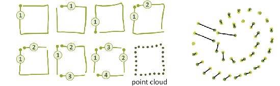
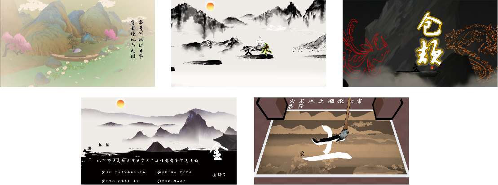

# 作品名称：《“文”字》

## 设计初衷：

​	汉语言文化是中华文化中最重要的一枚瑰宝。正是有了汉字，我们炎黄子孙才有信息表达和记录的工具，才能有文明的传承，有中华上下五千年的文化。所以我们想设计一款游戏，继续传承和发扬中华汉语言文化。

## 作品简介：

​	“文”字的游戏类型为第三人称闯关解谜类游戏，采用水墨画的美术风格。 这是一个以“弘扬中华民族灿烂文明，促进中华汉语言文化传承”为宗旨的益智游戏作品。 玩家将在游戏中扮演一介举人，并在独特的文字世界中开启一段汉字之旅。在游戏过程中，玩家可以通过写下汉字，将汉字化形帮助自己度过难关，同时增强对它们的记忆和理解。不仅如此，在旅途中玩家还能收集五行八卦的字元素来创造自己的文字世界。

## 核心玩法：

​	在玩法方面，定下了“遇字-说字-解字-用字”的流程，当玩家遇到其他汉字后，需要先回答关于这些字的一些问题，答对后就能收集到该字的字帖，此时玩家需要在新收集的字帖上进行描摹以学会该字。在游戏中遇到难关时，玩家可以巧妙地利用学会的汉字，通过在字帖上临摹出特定的字来幻化出对应字含义的实体，帮助自己度过难关。

## 游戏乐趣点：

​	在游戏中，玩家可以通过和NPC的对话，和答题环节中收集汉字的信息。同时结合自身对汉字的理解和认识，巧妙地利用不同汉字地“能力”来跨过沟壑，解开机关。更有趣的是，汉字的效果并不是独立的。玩家可以通过在“土”上种“树”并浇“水”等方式灵活地结合不同汉字的特性，寻找不同的过关方式。

## 游戏创意点说明

#### 实现基于点云识别的笔迹检测：

​	为了实现游戏核心玩法，识别玩家在屏幕上书写的汉字，我们参考了《Gesture as Point Clouds : A $p Recognizer for User Interface Prototypes》一文中提出的一种基于点云识别的笔迹识别算法，以及一种对采样点集预处理的方案，最后我们成功将此算法在程序中复现，完美实现了手写笔迹识别的功能。

## 美术风格

​	本作采用了水墨画这一类美术风格，水墨相调，展现干湿浓淡的层次感；水墨交融，表现似像非像的特征，使玩家产生丰富的遐想。作品中的水墨不拘泥于物体的描述，而追求一种以形写神的感觉

