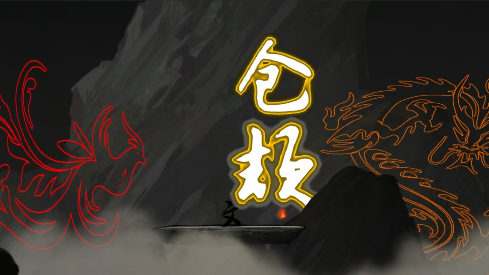

# 作品名称：《“文”字》

## 设计初衷：

​	汉语言文化是中华文化中最重要的一枚瑰宝。正是有了汉字，我们炎黄子孙才有信息表达和记录的工具，才能有文明的传承，有中华上下五千年的文化。所以我们想设计一款游戏，继续传承和发扬中华汉语言文化。

## 作品简介：

​	“文”字的游戏类型为第三人称闯关解谜类游戏，采用水墨画的美术风格。 这是一个以“弘扬中华民族灿烂文明，促进中华汉语言文化传承”为宗旨的益智游戏作品。 玩家将在游戏中扮演一介举人，并在独特的文字世界中开启一段汉字之旅。在游戏过程中，玩家可以通过写下汉字，将汉字化形帮助自己度过难关，同时增强对它们的记忆和理解。不仅如此，在旅途中玩家还能收集五行八卦的字元素来创造自己的文字世界。

## 核心玩法：

​	在玩法方面，定下了“遇字-说字-解字-用字”的流程，当玩家遇到其他汉字后，需要先回答关于这些字的一些问题，答对后就能收集到该字的字帖，此时玩家需要在新收集的字帖上进行描摹以学会该字。在游戏中遇到难关时，玩家可以巧妙地利用学会的汉字，通过在字帖上临摹出特定的字来幻化出对应字含义的实体，帮助自己度过难关。

## 各个模块设计：

**开头动画界面**

 

​													开头动画CG界面图1

 

​													开头动画CG界面图2

**主菜单界面**

 

​														游戏主菜单界面图

**设置界面**

 

​														音量设置界面图

**开发者界面**

 

​													开发者信息界面图

**场景加载界面**

 

​													场景加载界面图

 

**过场动画界面**

 

​													过场动画界面图

**对话及答题界面**

 

​													与NPC对话界面图

 

 

​														答题界面图

**书写界面**

 

​														书写界面图1

 

 

​														书写界面图2

**部分关卡界面**

 

​														关卡界面图1

 

​														关卡界面图2

 

​													关卡界面图3

 

​														关卡界面图4

 

​														关卡界面图5

## 游戏乐趣点：

​	在游戏中，玩家可以通过和NPC的对话，和答题环节中收集汉字的信息。同时结合自身对汉字的理解和认识，巧妙地利用不同汉字地“能力”来跨过沟壑，解开机关。更有趣的是，汉字的效果并不是独立的。玩家可以通过在“土”上种“树”并浇“水”等方式灵活地结合不同汉字的特性，寻找不同的过关方式。

## 游戏创意点说明

**基于点云识别的笔迹检测**

1. **需求分析**

在实现游戏的核心玩法时，我们想要程序能够识别玩家在屏幕上用笔刷书写的汉字，并在识别后与目标模板汉字进行匹配并计算出匹配程度，即玩家书写的准确性。

为了实现这一功能，我们首先想到的就是对屏幕上绘制的连续的笔迹采样，生成一个二维空间中离散的点集。但直接采样得到的点集如果未进行预处理，就无法很好地应对玩家将字写的过小或过大等导致采样点集出现假误差的状况。

**2. 解决方案**

针对上述提到的问题，我们在网络上查找了相关资料，最终发现《Gesture as Point Clouds : A $P Recognizer for User Interface Prototypes》一文中提出了一种基于点云识别地笔迹识别算法，并提供了一种对采样点集预处理的方案。结合该文献中提出的方法，我们提出了一套解决方案。

（1）对连续笔迹采样得到离散点集

该算法对于连续笔迹的处理方式与我们一开始采用的方式相同，即将连续笔画采样成离散的点集，从而避开书写时笔画的顺序、数量对书写结果比较的影响。由于Untiy引擎中线段的绘制本身就是用大量连续的点相连得到，所以我们可以获取组成笔迹的每一个点。

​                                

​                                       文献中连续笔迹处理方案示意图

（2）对离散点集进行预处理

由于玩家每次书写的笔迹大小、长度和位置的差异会带来原始的采样点集大小和中心点的较大差距，因此我们需要对所有的原始采样点进行3步的预处理。

***\*①缩放点集到[\*******\*1,1]\*******\*大小平面空间\****

由于玩家每次书写的笔迹大小、长度和位置的差异会带来原始的采样点集大小和中心点的较大差距，因此我们首先算出点集整体的 “长”和“宽”，并按照长宽分别缩放每个点的坐标，使所有点保持在[1,1]大小平面空间中。

 

【图27】预处理第①步算法伪代码

***\*②平移点集到坐标系原点\****

​	为了方便后续的计算，我们计算出缩放后点集的中心，并将点集中心点偏移到原点，使点集中心处在平面坐标系的原点。

 

​                                         预处理第②步算法伪代码

***\*③重采样得到新点集\****

​	为了后续匹配度的计算，我们需要规定参与计算的采样点的数量来统一所有笔迹的点数。对于缩放、中心化后的点集。首先算出点与点连成的笔迹的总长度，再根据所需重采样点数确定新采样点集的采样距离跨度，最后根据该采样跨度对原点集重采样得到新点集。

 

​                                            预处理第③步算法伪代码

（3）匹配值计算

求出预处理后的点集与我们准备好的模板点集之间的最近点距和。当距离和小于设定的目标值时，判定识别成功。在计算点距时还可以加上对不同点权重的考虑。

​                                     

​                                                   点距计算示意图

 

​                                                点距计算算法伪代码

## 美术风格

​	本作采用了水墨画这一类美术风格，水墨相调，展现干湿浓淡的层次感；水墨交融，表现似像非像的特征，使玩家产生丰富的遐想。作品中的水墨不拘泥于物体的描述，而追求一种以形写神的感觉

# 参考文献

[1] Vatavu, R.-D., Anthony, L. and Wobbrock, J.O. (2012). Gestures as point clouds: A $P recognizer for user interface prototypes. Proceedings of the ACM International Conference on Multimodal Interfaces (ICMI '12). Santa Monica, California (October 22-26, 2012). New York: ACM Press, pp. 273-280.